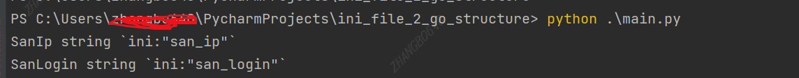

# ini_file_2_go_structure

##  Describe

    Support convert ini format config file into golang structure. Do not support ini section! If your .ini file has sections,

do the job as time as your section numbers.

## Using

1) Place your ini file in ./confs;
2) Update main.go with yours ini file name;
3) Execute project for result;

